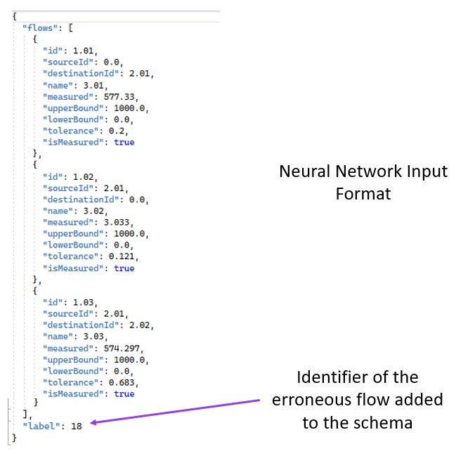
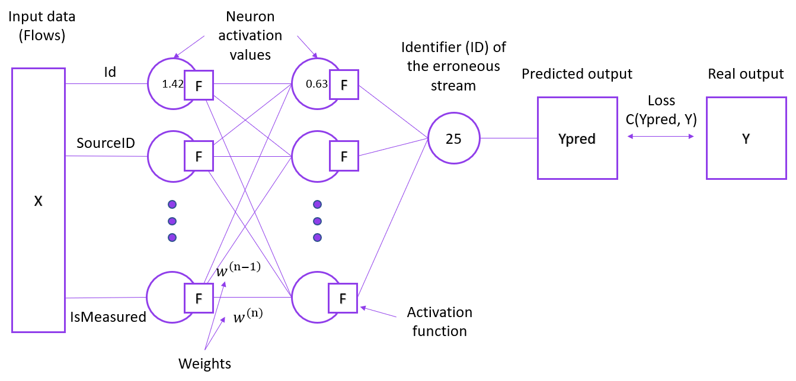

# GEDneuralNetwork
A neural network created to search for gross errors in the technological balance diagrams of an enterprise
## Input data format
</img>
## Neural network structure
</img>
## Tools used for development:
Programming language: Python 3.8\
ML Framework: Pytorch 1.13
